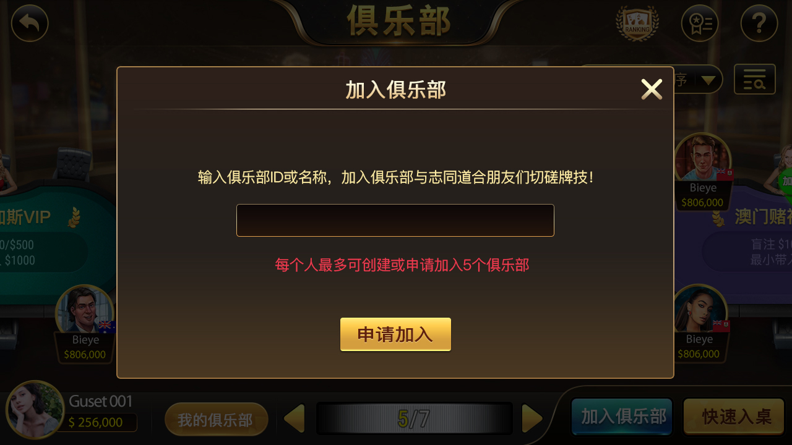
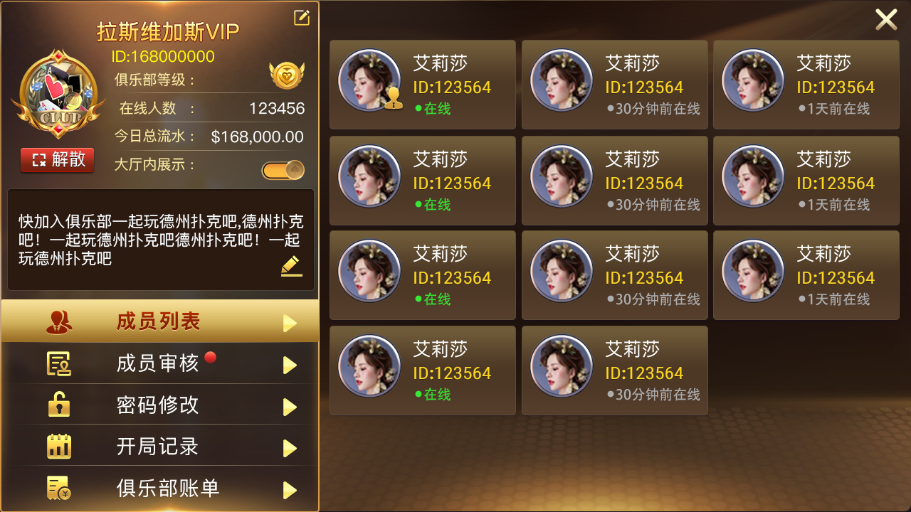
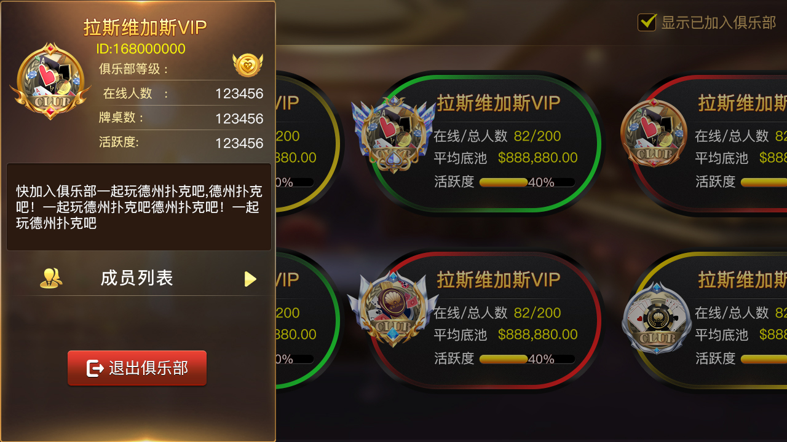
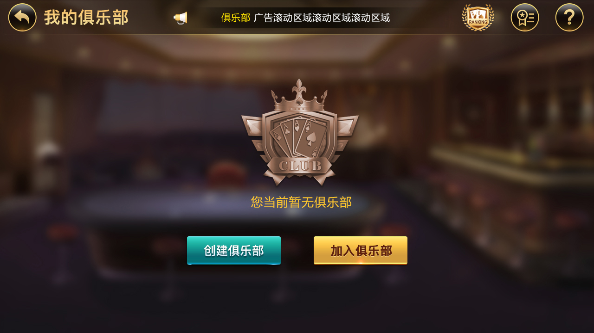
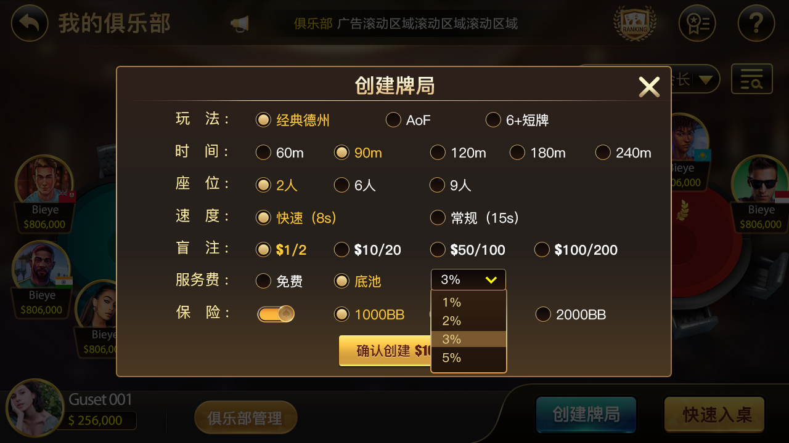

# 🃏 德州私人局源码(德州源码)｜朋友局 | 德州俱乐部 |
# 🃏 德州扑克服务端引擎 | C++ 高并发多人游戏源码

[](https://github.com/niubideren111/Texas-Hold-em-source-code/stargazers)
[](https://github.com/niubideren111/Texas-Hold-em-source-code/network)
[](LICENSE)
[](https://isocpp.org/)
[](https://developer.mozilla.org/en-US/docs/Web/API/WebSocket)
[](https://www.docker.com/)

**高性能、高并发的德州扑克服务端引擎**，采用 C++ 开发，基于 WebSocket 实现实时通信。完整支持经典德州、短牌、奥马哈等多种玩法，内置 SNG、MTT 锦标赛系统，专为搭建**私人局、朋友局、俱乐部联盟**等场景设计，是学习和研究**多人游戏服务器架构**的理想参考实现。

> **⚠️ 重要声明**：本项目**仅供学习和研究使用**，严格禁止用于任何真实货币赌博。商业使用请自行遵守当地法律法规，作者不承担任何法律责任。

---

## 📑 目录

- [项目亮点](#-项目亮点)
- [功能特性](#-功能特性)
- [快速开始](#-快速开始)
- [技术架构](#-技术架构)
- [项目截图](#-项目截图)
- [未来路线图](#-未来路线图)
- [如何贡献](#-如何贡献)
- [联系方式](#-联系方式)
- [许可证](#-许可证)

---

## ✨ 项目亮点

- **🎯 服务器权威架构**：所有游戏逻辑在服务端执行，有效防止作弊和外挂，保证游戏公平性。
- **⚡ 高并发实时通信**：基于 WebSocket 协议，实现低延迟、高并发的多人实时对战体验。
- **🧠 内置 AI Bot**：内置智能机器人，可用于功能测试或自动填充空闲桌位，方便单机调试。
- **🧩 模块化设计**：C++ 代码结构清晰，业务逻辑与网络层分离，易于二次开发和功能扩展。
- **💾 数据持久化**：完整记录手牌历史、玩家行为日志，便于反作弊分析和数据统计。
- **🐳 一键部署**：提供 Docker 镜像和 docker-compose 配置，新手也能快速启动完整服务。

---

## 🎮 功能特性

| 模块 | 功能说明 |
| :--- | :--- |
| **经典德州扑克** | 支持 6 人桌 / 9 人桌，完整的下注、加注、弃牌、摊牌逻辑 |
| **私人局 / 朋友局** | 好友约局、创建私人房间，支持密码保护和观战模式 |
| **俱乐部 / 联盟系统** | 创建或加入俱乐部，进行内部排名赛，支持俱乐部战绩统计 |
| **锦标赛系统** | 支持多桌锦标赛 (MTT)、坐满即玩 (SNG)、赏金赛、卫星赛 |
| **特色玩法** | 支持**短牌 (Short Deck)**、奥马哈 (Omaha) 等多种扑克变体 |
| **社交与安全** | 内置好友系统、表情聊天，以及智能反作弊风控模块和操作日志审计 |

---

📖 详细的编译选项、配置文件说明和协议文档，请查看项目根目录下的 docs/ 文件夹。

##🏗️ 技术架构

    服务端：C++ 11/14/17，基于高性能网络框架，支持 Linux 环境水平扩展

    客户端：提供 Unity 2019+ (C#) 示例客户端，可打包 Android / iOS / PC 平台

    通信协议：WebSocket + 自定义二进制协议，保证数据传输效率

    数据存储：MySQL 存储持久化数据，Redis 缓存热数据和高频访问信息

    配套工具：包含后台管理系统、机器人配置工具、游戏日志分析查看器


---

## 📸 项目截图（真实界面展示）
















## 获取仓库

```bash
git clone https://github.com/niubideren111/Texas-Hold-em-source-code.git
cd Texas-Hold-em-source-code
```

克隆后从上面的文件入口开始阅读。若需要运行示例，请先核对项目中实际存在的依赖、版本、配置和启动脚本。

## 常见问题

### 与俱乐部源码项目如何选择？
本项目突出私人牌桌、朋友组局、Unity 场景和玩法流程；另一项目突出俱乐部服务接口与构建资料。

### 是否提供 Docker 一键启动？
当前公开文件中没有完整的 Docker Compose 部署工程，本页不提供一键启动承诺。

当前公开文件中没有完整的 Docker Compose 部署工程，本页不提供一键启动承诺。

## 相关项目

- [dezhou-poker-club-source-code](https://github.com/niubideren111/dezhou-poker-club-source-code)
- [Texas-Holdem-Game-Source-Code](https://github.com/niubideren111/Texas-Holdem-Game-Source-Code)

## 项目咨询

- Telegram：[fox_lovemyself](https://t.me/fox_lovemyself)
- GitHub：[德州私人局与朋友局源码](https://github.com/niubideren111/Texas-Hold-em-source-code)

## 许可

请按仓库现有 [LICENSE](LICENSE) 与 [License.md](License.md) 使用公开文件。商业工程、美术资源和完整部署资料的授权范围以书面约定为准。


## ⭐ 支持项目
如果你觉得这个德州扑克源码有帮助，欢迎 Star 支持！


再次声明：本仓库为开源学习项目，不包含任何支付或真实赌博功能。请遵守当地法律法规，合理使用。


This project focuses on real-time game architecture and system design.

For advanced implementations or custom game backend systems, professional discussions are welcome.


